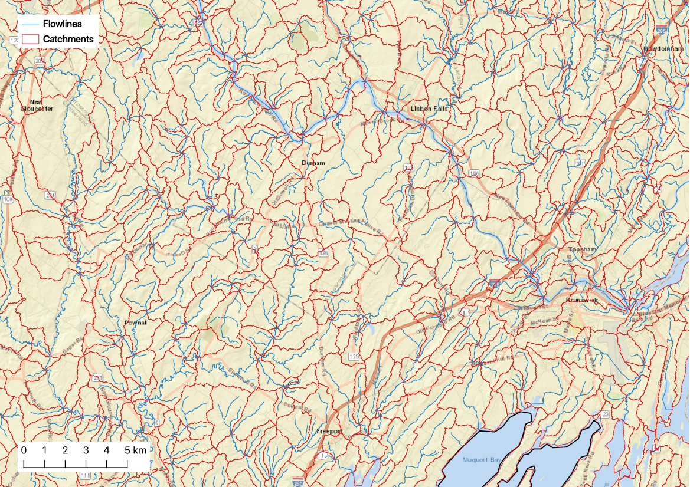
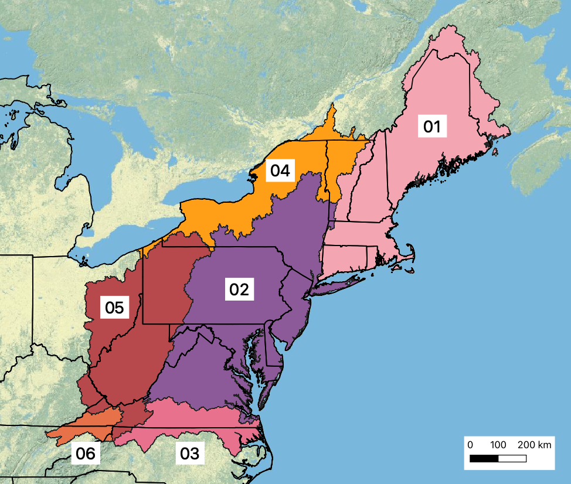

# Catchment Delineation


The EcoSHEDS Northeast Catchment Delineation (NECD) is a series of geospatial layers representing hydrologic catchments and flowlines spanning the northeast region of the United States. The NECD sought to address specific aspects of the national hydrography products that were available at the time this delineation was created. Specifically, improved spatial resolution and consistency were the focus of the development of NECD. Another goal of this product was to capture small headwater streams omitted by existing products such as the medium resolution catchments in NHDPlus Version 2. Representing these streams can be critical to understanding key ecological interests.



The NECD catchment delineation process was based on NHD high resolution flowlines and a 30m resolution digital elevation model (DEM). At the time it was developed, there were no large scale catchment products derived from these flowlines^[The NHDPlus High Resolution (HR) dataset now provides delineated catchments, but these were not available when NECD was developed]. By using the NHD flowlines, the NECD data products include attribute fields indicating routing paths, which can be used to establish the network structure.

The data products include two sets of flowlines: detailed and truncated. The detailed flowlines are the NHD high resolution flowlines that served as the starting point for this delineation. The truncated flowlines are a subset of the detailed flowlines that only include stream segments with a drainage area of more than 0.75 km^2^. The truncated flowlines were then used to delineate the individual catchments. This truncation process was used to ensure consistency in the spatial resolution of the flowlines across the entire region.

In both the catchment and flowline layers, the `FEATUREID` attribute is used as the unique ID assigned to each catchment. 

More details about the motivation and methodology used to develop the NECD data products as well as definitions of each attribute field are provided in the documentation:

**Documentation:**

```{r delineation-copy}
invisible(file.copy("../delineation/EcoSHEDS NECD Catchment Delineation Documentation.docx", "./downloads/EcoSHEDS NECD Catchment Delineation Documentation.docx"))
```

- [EcoSHEDS NECD Catchment Delineation Documentation.docx](./downloads/EcoSHEDS NECD Catchment Delineation Documentation.docx)

**Downloads:** the NECD shapefiles are available for download in pre-staged HUC2 regions (see map below for region boundaries)

- [spatial_01.zip](`r paste0(base_url, "delineation/spatial_01.zip")`): Region 01
- [spatial_02.zip](`r paste0(base_url, "delineation/spatial_02.zip")`): Region 02
- [spatial_03.zip](`r paste0(base_url, "delineation/spatial_03.zip")`): Region 03
- [spatial_04.zip](`r paste0(base_url, "delineation/spatial_04.zip")`): Region 04
- [spatial_05.zip](`r paste0(base_url, "delineation/spatial_05.zip")`): Region 05
- [spatial_06.zip](`r paste0(base_url, "delineation/spatial_06.zip")`): Region 06

Each zip file contains the following shapefiles:

- `Catchments##.shp`: catchment polygons
- `detailedFlowlines##.shp`: detailed flowlines (from NHD)
- `truncatedFlowlines##.shp`: truncated flowlines (drainage area >= 0.75 km^2^)
- `regionboundary##.shp`: region boundary


