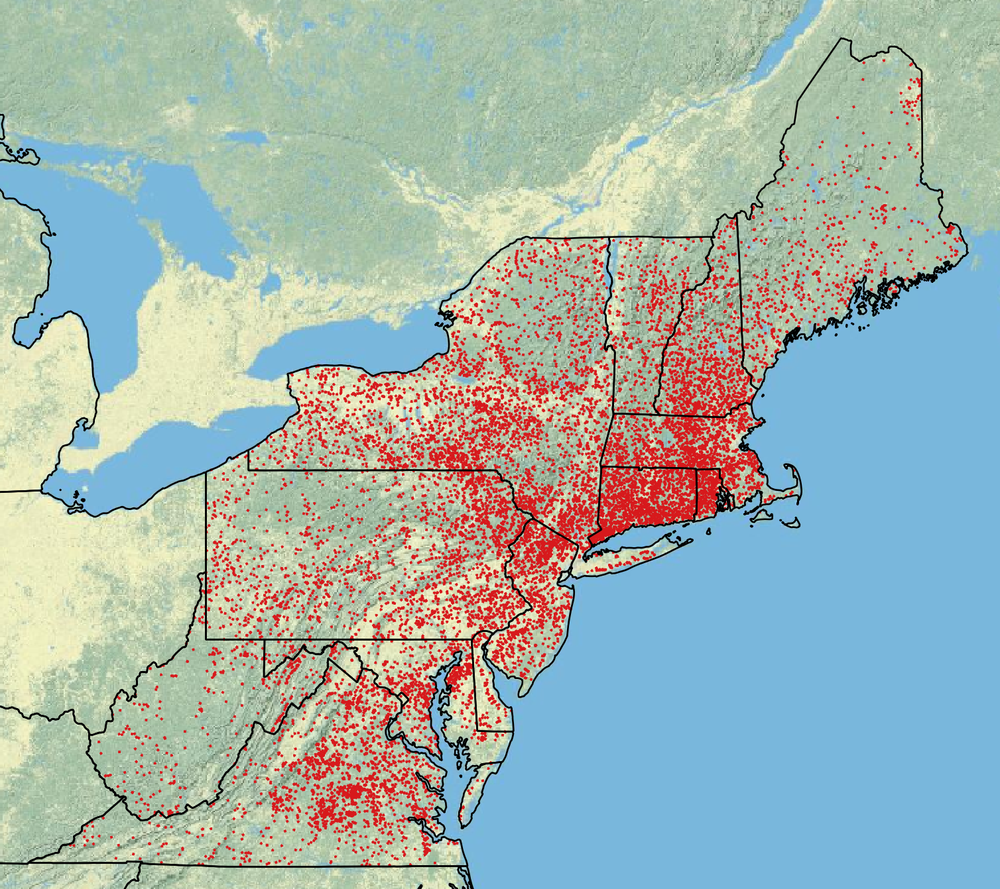

# Impoundment Influence Zones

The impoundment influence zones layer was created using a network analysis methodology that maps a user-specified length downstream from an impoundment. Currently, only a 100m influence zone has been generated.

A shapefile of dam locations were used from the UMass Designing Sustainable Landscapes (DSL) Project version of The Nature Conservancy's dam inventory with locations snapped to the NHD high resolution flowlines.

The impoundment influence zones are used to identify stream temperature monitoring sites that are potentially influenced by upstream impoundments. 

**Data Sources:**

| Layer          | Source                                  |
| :------        | :-----                                  |
| Dam Locations  | UMass Land Ecology Lab - DSL Project    |
| Flowlines      | EcoSHEDS Northeast Catchment Delineation|

**Downloads:**

- [impoundedZones100m.zip](`r paste0(base_url, "impoundedZones100m.zip")`): shapefile of 100m impoundment influence zones