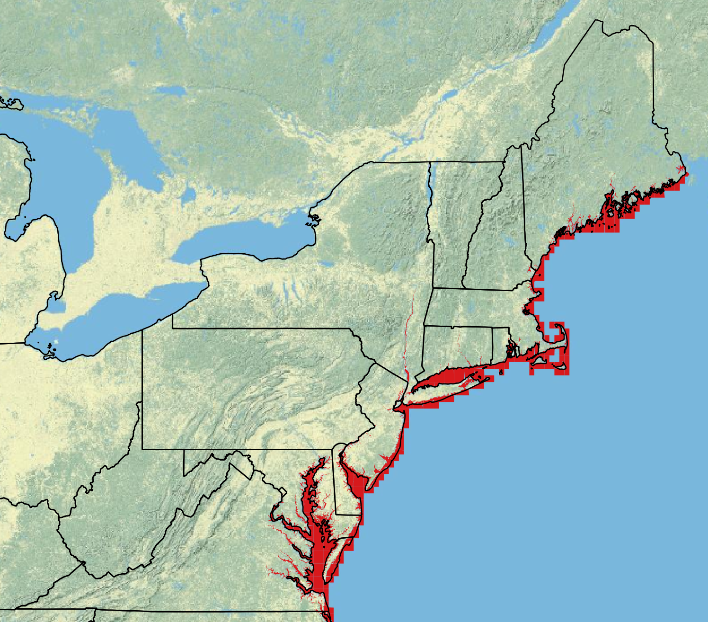

# Tidal Influence Zones

The tidal influenced zones were created from the [U.S. Fish & Wildlife National Wetlands Inventory](https://www.fws.gov/program/national-wetlands-inventory/data-download) polygon layers. All of the polygons that have any form of tidal influence as defined by the [NWI Wetlands and Deepwater Map Code Diagram](http://www.fws.gov/wetlands/Documents/NWI_Wetlands_and_Deepwater_Map_Code_Diagram.pdf) were indexed. The polygons were joined together and exported to a single shapefile representing all bodies of water that are impacted by tides within the EcoSHEDS NECD range. This layer is used to identify stream temperature monitoring sites that are potentially influenced by tides.

**Data Sources:**

| Layer                        | Source                                  |
| :------                      | :-----                                  |
| National Wetlands Inventory  | [U.S. Fish & Wildlife National Wetlands Inventory](https://www.fws.gov/program/national-wetlands-inventory/data-download)    |

**Downloads:**

- [tidalZones.zip](): shapefile of tidal influence zones