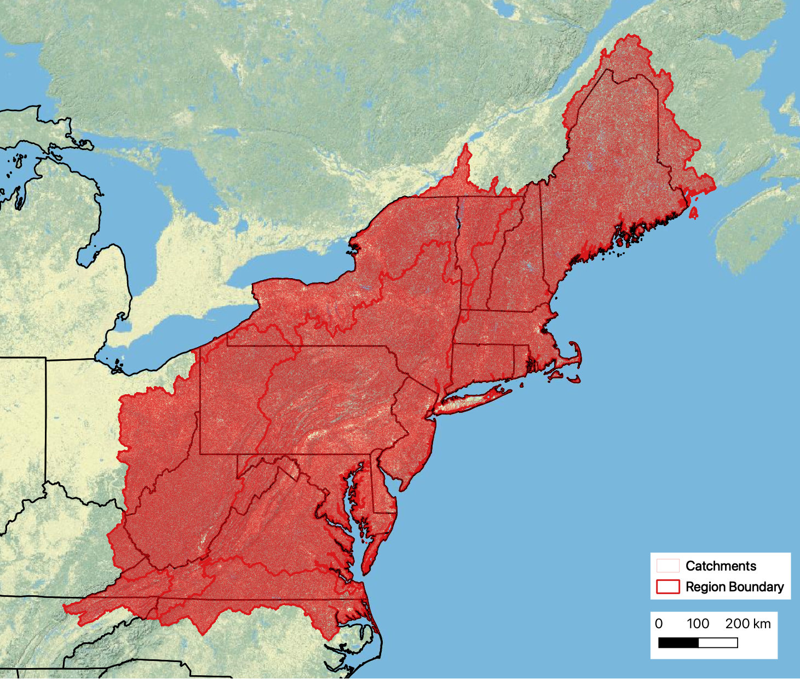

--- 
title: "EcoSHEDS Northeast Catchment Delineation (NECD)"
author: "[Jeffrey D. Walker](https://walkerenvres.com), [Kyle O'Neil](https://github.com/Tom-Bombadil), [Benjamin Letcher](https://www.usgs.gov/staff-profiles/benjamin-h-letcher)"
date: "Updated: `r Sys.Date()`"
site: bookdown::bookdown_site
output: bookdown::gitbook
documentclass: book
bibliography: []
biblio-style: apalike
link-citations: yes
github-repo: ecosheds/necd
description: "Documentation for the EcoSHEDS Northeast Catchment Delineation (NECD)"
---


```{r setup, echo = FALSE}
library(tidyverse)

dir.create("./downloads", showWarnings = FALSE)

base_url <- "https://ecosheds.s3.amazonaws.com/necd/"

knitr::opts_chunk$set(echo = FALSE, message = FALSE, warning = FALSE, comment = NA)
```

# Introduction

The EcoSHEDS Northeast Catchment Delineation (NECD)^[NECD was formerly called the National Hydrography Dataset High Resolution Delineation Version 2 (NHDHRDV2). It has been renamed to avoid confusion with the [USGS NHDPlus High Resolution (HR)](https://www.usgs.gov/national-hydrography/nhdplus-high-resolution) dataset, which was not yet available when this dataset was created.] is a high resolution catchment delineation of the northeast U.S. It was created in 2015 by Kyle O'Neil to support the EcoSHEDS northeast stream temperature and brook trout occupancy models. In addition to the flowlines and catchment polygons, NECD includes a number of additional data products created to support the EcoSHEDS northeast stream temperature and brook trout occupancy models such as landscape and climate metrics as well as zones of impoundment and tidal influence.

This dataset was developed as part of the [EcoSHEDS](https://usgs.gov/apps/ecosheds/) project.



NECD includes the following data products:

- [Catchment Delineation] - catchments and flowlines
- [Basin Characteristics] - landscape and climate metrics
- [Impoundment Influence Zones] - areas influenced by upstream impoundments
- [Tidal Influence Zones] - areas influenced by tidal exchanges

[Downloads] contains a list of all available data products.

Source code is available at [EcoSHEDS/necd](https://github.com/EcoSHEDS/necd).